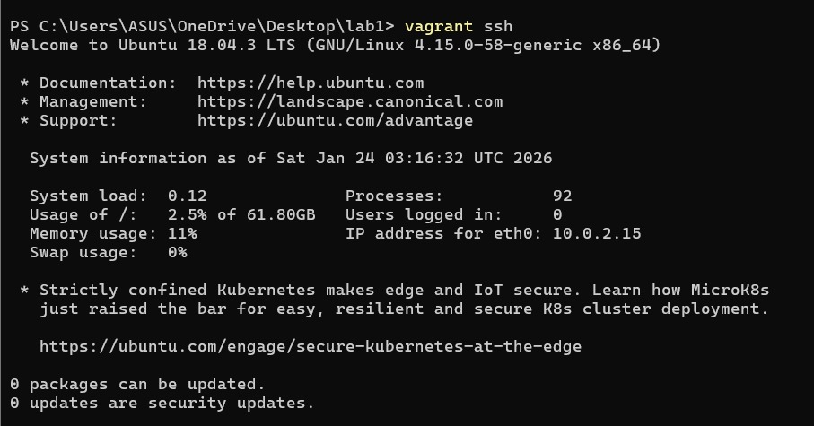
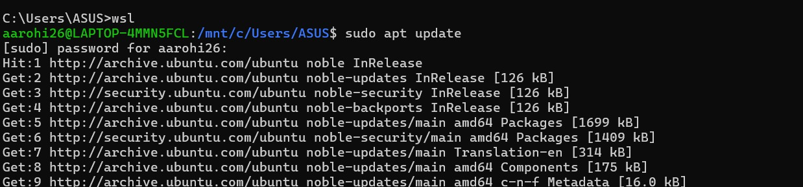
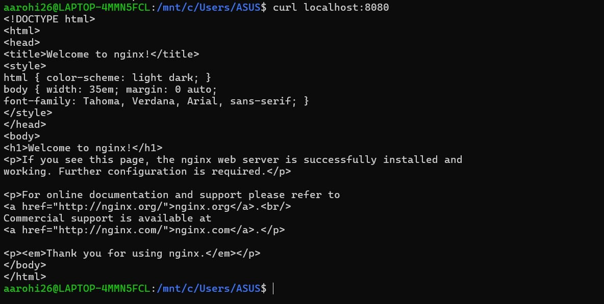
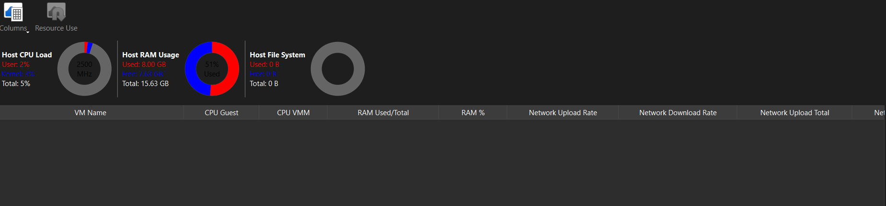

Step 1: Download Virtual Box from [here](https://www.virtualbox.org/wiki/Downloads)

**Step 2:Download Vagrant from [here](https://developer.hashicorp.com/vagrant/install)


Step 3:To verify the installation we will check the version via following command
``` bash
vagrant --version
```


Step 4:Initialize Vagrant with Ubuntu box:
```bash
vagrant init hashicorp/bionic64
```


Step 5:Start the VM:
   ```bash
   vagrant up
   ```


Step 6:Access the VM:
```bash
vagrant ssh
```



Step 7: Install Nginx inside VM
```bash
sudo apt update
sudo apt install -y nginx
sudo systemctl start nginx
```


Step 8: Verify Nginx
```bash
curl localhost
``` 


Step 9: Utilization Matrix In Running State


Step 10:Stop VM
```bash
vagrant halt
```


Step 11: Utilization Matrix In Stop State


Step 12:Remove VM
```bash
vagrant destroy
```


