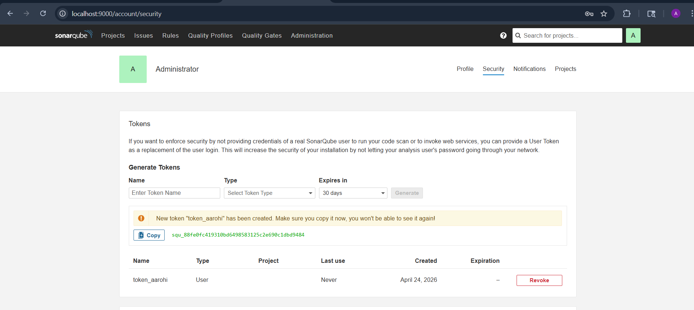
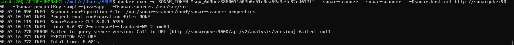
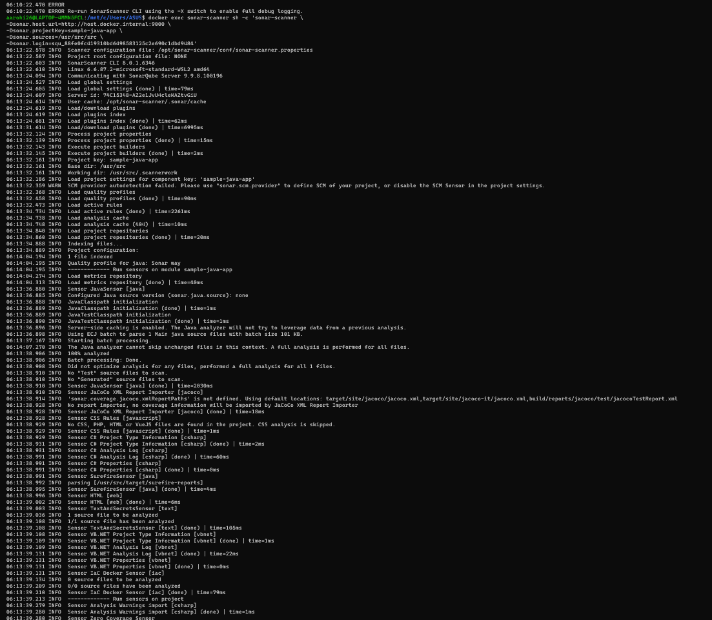

# SonarQube Code Quality Analysis using Docker, Maven, and Jenkins

## 📌 Objective

To set up SonarQube using Docker, analyze a Java application for bugs, vulnerabilities, and code smells, and integrate it with Jenkins for CI/CD-based quality checks.

---

## 🛠️ Tools & Technologies Used

* Docker & Docker Compose
* SonarQube (LTS Community Edition)
* PostgreSQL
* Maven
* Jenkins
* Java (Sample Application)

---

## 🚀 Step 1: Setup SonarQube Environment

### Create Docker Network

```bash
docker network create sonarqube-lab
```


### Start PostgreSQL Database

```bash
docker run -d \
  --name sonar-db \
  --network sonarqube-lab \
  -e POSTGRES_USER=sonar \
  -e POSTGRES_PASSWORD=sonar \
  -e POSTGRES_DB=sonarqube \
  -v sonar-db-data:/var/lib/postgresql/data \
  postgres:13
```


### Start SonarQube Server

```bash
docker run -d \
  --name sonarqube \
  --network sonarqube-lab \
  -p 9000:9000 \
  -e SONAR_JDBC_URL=jdbc:postgresql://sonar-db:5432/sonarqube \
  -e SONAR_JDBC_USERNAME=sonar \
  -e SONAR_JDBC_PASSWORD=sonar \
  -v sonar-data:/opt/sonarqube/data \
  -v sonar-extensions:/opt/sonarqube/extensions \
  sonarqube:lts-community
```

### Verify Logs

```bash
docker logs -f sonarqube
```


### Access SonarQube

* URL: http://localhost:9000
* Default Login: `admin / admin`


---

## 📦 Alternative: Docker Compose Setup

```yaml
version: '3.8'

services:
  sonar-db:
    image: postgres:13
    container_name: sonar-db
    restart: unless-stopped
    environment:
      POSTGRES_USER: sonar
      POSTGRES_PASSWORD: sonar
      POSTGRES_DB: sonarqube
    volumes:
      - sonar-db-data:/var/lib/postgresql/data
    networks:
      - sonarqube-lab

  sonarqube:
    image: sonarqube:lts-community
    container_name: sonarqube
    restart: unless-stopped
    ports:
      - "9000:9000"
    environment:
      SONAR_JDBC_URL: jdbc:postgresql://sonar-db:5432/sonarqube
      SONAR_JDBC_USERNAME: sonar
      SONAR_JDBC_PASSWORD: sonar
    volumes:
      - sonar-data:/opt/sonarqube/data
      - sonar-extensions:/opt/sonarqube/extensions
    depends_on:
      - sonar-db
    networks:
      - sonarqube-lab

volumes:
  sonar-db-data:
  sonar-data:
  sonar-extensions:

networks:
  sonarqube-lab:
    driver: bridge
```

Run:

```bash
docker compose up -d
```


---

## 💻 Step 2: Create Sample Java Application

### Create Project Structure

```bash
mkdir -p sample-java-app/src/main/java/com/example
```


### Add Java Code (with issues)

(Create `Calculator.java` as provided in experiment)

---


## 📦 Step 3: Maven Configuration

### Create `pom.xml`

(Use provided pom.xml)

### Build Project

```bash
cd sample-java-app
mvn clean install
```


---

## 🔍 Step 4: SonarQube Scanner Setup

### Run Scanner via Docker

```bash
docker run -d \
  --name sonar-scanner \
  --network sonarqube-lab \
  -v $(pwd)/sample-java-app:/usr/src \
  sonarsource/sonar-scanner-cli \
  sleep infinity
```


---

## 🔐 Step 5: Generate Token

* Go to SonarQube Dashboard
* My Account → Security → Generate Token
* Copy token

---



## ⚙️ Step 6: Run Code Analysis

```bash
docker exec -e SONAR_TOKEN="your-token" \
  sonar-scanner \
  sonar-scanner \
  -Dsonar.host.url=http://sonarqube:9000 \
  -Dsonar.projectKey=sample-java-app \
  -Dsonar.sources=/usr/src/src
```

---

## 📊 Step 7: View Results

Open:

```
http://localhost:9000/dashboard?id=sample-java-app
```


### Observed Issues:

* Bugs: Division by zero, Null pointer
* Vulnerability: SQL Injection
* Code Smells:

  * Unused variables
  * Duplicate code
  * Too many parameters
  * Empty catch block

### Metrics:

* Bugs: ~8
* Vulnerabilities: 1
* Code Smells: ~12
* Duplications: 2 blocks
* Test Coverage: 0%
* Technical Debt: ~2 hours

---

## ⚠️ Challenges Faced & Solutions

### 1. SonarQube Not Starting

* Cause: Low system memory
* Solution:

```bash
sysctl -w vm.max_map_count=262144
```

---

### 2. Database Connection Failure

* Cause: Incorrect JDBC URL
* Solution: Ensure correct service name (`sonar-db`)

---

### 3. Scanner Not Connecting

* Cause: Network mismatch
* Solution: Use same Docker network

---

### 4. Token Authentication Error

* Cause: Invalid token
* Solution: Regenerate token

---

## ✅ Conclusion

This experiment demonstrated how to:

* Deploy SonarQube using Docker
* Analyze code quality issues in a Java application
* Identify bugs, vulnerabilities, and code smells
* Integrate SonarQube with Jenkins for CI/CD
* Enforce Quality Gates before deployment

SonarQube helps improve code reliability, maintainability, and security by detecting issues early in the development lifecycle.

---

## 📎 Future Improvements

* Add unit test coverage
* Fix detected issues
* Integrate with GitHub Actions
* Enable automated reports
