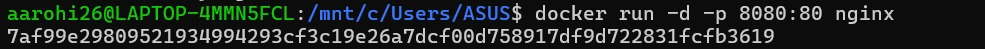
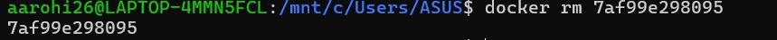
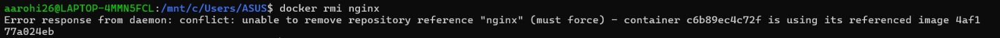

## Experiment 2:- Docker Installation, Configuration, and Running Images

**Step 1: Pull Image**

```bash
docker --version
```


**Step 2: Run Container with Port Mapping**

```bash
docker run -d -p 8080:80 nginx
```



**Step 3: Verify Running Containers**

```bash
docker ps
```


**Step 4: Stop Container**

```bash
docker stop <container_id>
```


**Step 5: Remove Container**

```bash
docker rm <container_id>
```



**Step 5: Remove Image**

```bash
docker rmi nginx
```



**Result**
Docker images were successfully pulled, containers executed, and lifecycle commands performed.