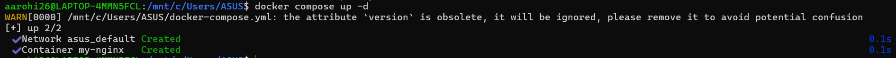
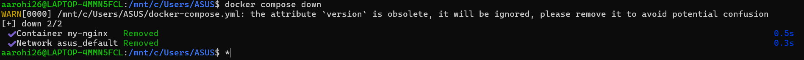
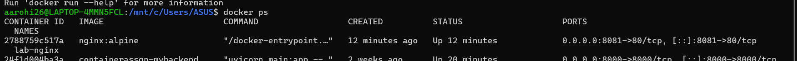
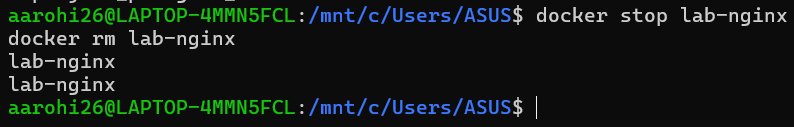
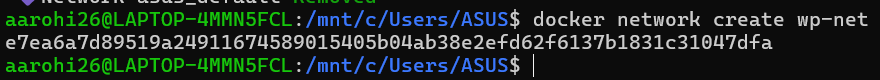
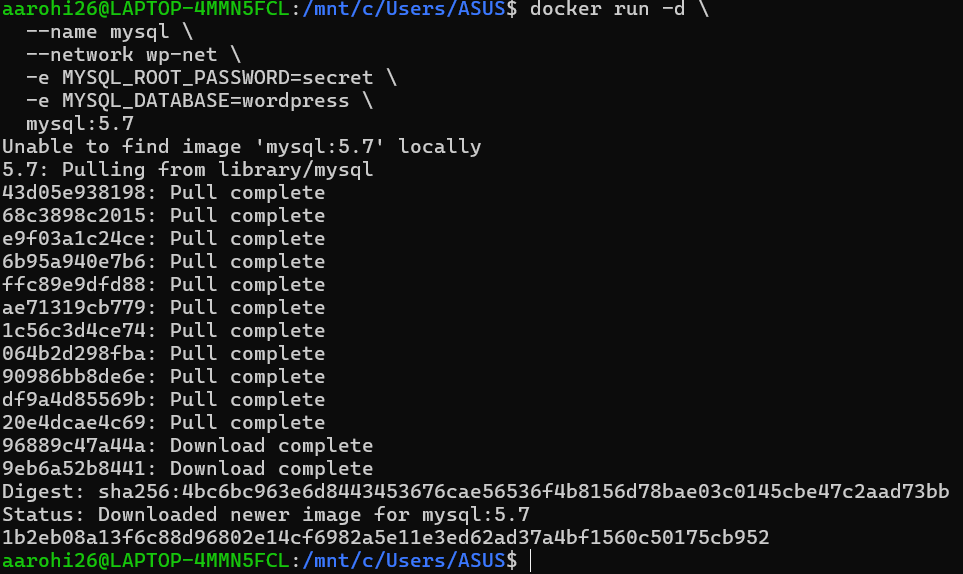
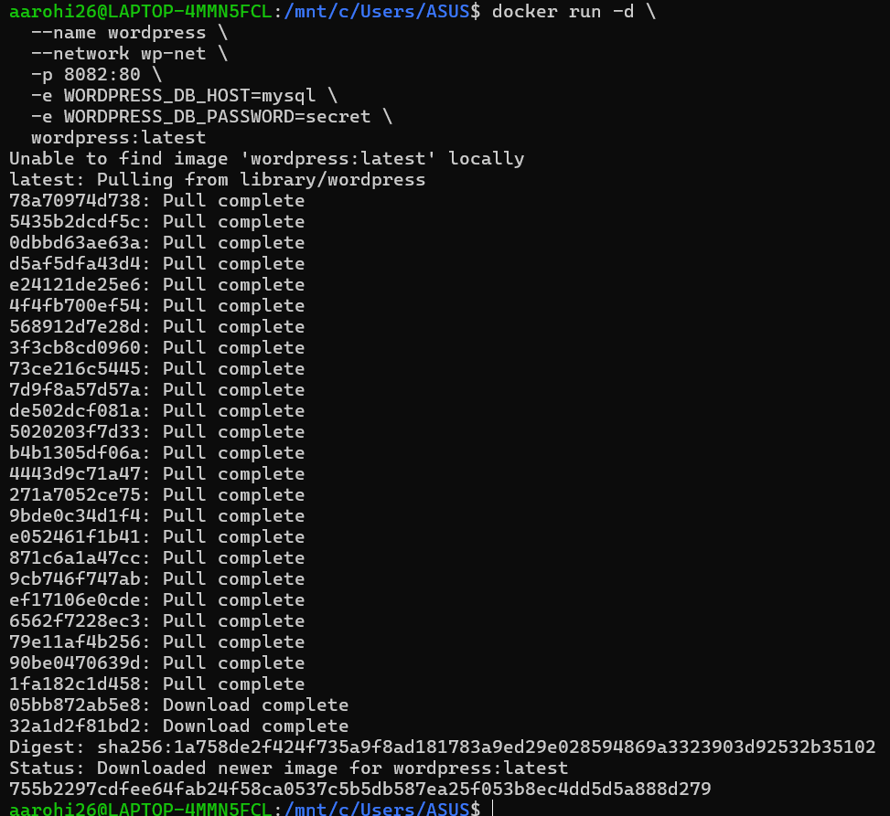

# 🐳 Docker & Docker Compose Lab README

## 📌 Overview

This lab demonstrates:

* Difference between **Docker Run (imperative)** and **Docker Compose (declarative)**
* Running **single-container** and **multi-container applications**
* Converting Docker commands into Compose files
* Using **Dockerfile with Compose**
* Advanced concepts like **multi-stage builds and resource limits**

---

# 🔹 PART A – Docker Run vs Docker Compose

## Docker Run (Imperative)

```bash
docker run -d \
  --name lab-nginx \
  -p 8081:80 \
  -v $(pwd)/html:/usr/share/nginx/html \
  nginx:alpine
```


## Docker Compose (Declarative)

```yaml
version: '3.8'

services:
  nginx:
    image: nginx:alpine
    container_name: lab-nginx
    ports:
      - "8081:80"
    volumes:
      - ./html:/usr/share/nginx/html
```

Run:

```bash
docker compose up -d
```


Stop:

```bash
docker compose down
```

---

# 🔹 PART B – PRACTICAL TASKS

## Task 1: Single Container

### Using Docker Run

```bash
docker run -d \
  --name lab-nginx \
  -p 8081:80 \
  -v $(pwd)/html:/usr/share/nginx/html \
  nginx:alpine

docker ps
```

Access:

```
http://localhost:8081
```

Stop:

```bash
docker stop lab-nginx
docker rm lab-nginx
```


---

### Using Docker Compose

```yaml
version: '3.8'

services:
  nginx:
    image: nginx:alpine
    container_name: lab-nginx
    ports:
      - "8081:80"
    volumes:
      - ./html:/usr/share/nginx/html
```


Run:

```bash
docker compose up -d
docker compose ps
docker compose down
```


---

## Task 2: Multi-Container (WordPress + MySQL)

### Docker Run Approach

```bash
docker network create wp-net
```


```bash
docker run -d \
  --name mysql \
  --network wp-net \
  -e MYSQL_ROOT_PASSWORD=secret \
  -e MYSQL_DATABASE=wordpress \
  mysql:5.7
```


```bash
docker run -d \
  --name wordpress \
  --network wp-net \
  -p 8082:80 \
  -e WORDPRESS_DB_HOST=mysql \
  -e WORDPRESS_DB_PASSWORD=secret \
  wordpress:latest
```

---

### Docker Compose Approach

```yaml
version: '3.8'

services:
  mysql:
    image: mysql:5.7
    environment:
      MYSQL_ROOT_PASSWORD: secret
      MYSQL_DATABASE: wordpress
    volumes:
      - mysql_data:/var/lib/mysql

  wordpress:
    image: wordpress:latest
    ports:
      - "8082:80"
    environment:
      WORDPRESS_DB_HOST: mysql
      WORDPRESS_DB_PASSWORD: secret
    depends_on:
      - mysql

volumes:
  mysql_data:
```

Run:

```bash
docker compose up -d
docker compose down -v
```

---

# 🔹 PART C – CONVERSION TASKS

## Task 3 – Problem 1 (Web App)

```yaml
version: '3.8'

services:
  webapp:
    image: node:18-alpine
    container_name: webapp
    ports:
      - "5000:5000"
    environment:
      APP_ENV: production
      DEBUG: false
    restart: unless-stopped
```

---

## Task 3 – Problem 2 (Volume + Network)

```yaml
version: '3.8'

services:
  postgres-db:
    image: postgres:15
    container_name: postgres-db
    environment:
      POSTGRES_USER: admin
      POSTGRES_PASSWORD: secret
    volumes:
      - pgdata:/var/lib/postgresql/data
    networks:
      - app-net

  backend:
    image: python:3.11-slim
    container_name: backend
    ports:
      - "8000:8000"
    environment:
      DB_HOST: postgres-db
      DB_USER: admin
      DB_PASS: secret
    depends_on:
      - postgres-db
    networks:
      - app-net

volumes:
  pgdata:

networks:
  app-net:
```

Run:

```bash
docker compose up -d
docker compose down -v
```

---

## Task 4 – Resource Limits

```yaml
version: '3.8'

services:
  limited-app:
    image: nginx:alpine
    container_name: limited-app
    ports:
      - "9000:9000"
    restart: always
    deploy:
      resources:
        limits:
          cpus: "0.5"
          memory: 256M
```

### 🔍 Explanation

* `deploy` works **only in Docker Swarm**
* In normal Compose → ignored
* Swarm → enforces CPU & memory limits

---

# 🔹 PART D – DOCKERFILE WITH COMPOSE

## Task 5 – Node App Build

### app.js

```js
const http = require('http');

http.createServer((req, res) => {
  res.end("Docker Compose Build Lab");
}).listen(3000);
```

### Dockerfile

```Dockerfile
FROM node:18-alpine

WORKDIR /app
COPY app.js .

EXPOSE 3000

CMD ["node", "app.js"]
```

### docker-compose.yml

```yaml
version: '3.8'

services:
  nodeapp:
    build:
      context: .
      dockerfile: Dockerfile
    container_name: custom-node-app
    ports:
      - "3000:3000"
```

Run:

```bash
docker compose up --build -d
```

---

### 🔍 image vs build

* `image:` → pulls prebuilt image
* `build:` → creates custom image from Dockerfile

---

## Task 6 – Multi-Stage Dockerfile

### Example (Node)

```Dockerfile
# Stage 1 - Build
FROM node:18-alpine as builder
WORKDIR /app
COPY . .
RUN npm install

# Stage 2 - Production
FROM node:18-alpine
WORKDIR /app
COPY --from=builder /app .

EXPOSE 3000
CMD ["node", "app.js"]
```

### Compose

```yaml
version: '3.8'

services:
  app:
    build: .
    ports:
      - "3000:3000"
    environment:
      NODE_ENV: production
    volumes:
      - .:/app
```

Check size:

```bash
docker images
```

---

# 🔹 EXPERIMENT 6B – WORDPRESS PROJECT

### docker-compose.yml

```yaml
version: '3.9'

services:
  db:
    image: mysql:5.7
    container_name: wordpress_db
    restart: always
    environment:
      MYSQL_ROOT_PASSWORD: rootpass
      MYSQL_DATABASE: wordpress
      MYSQL_USER: wpuser
      MYSQL_PASSWORD: wppass
    volumes:
      - db_data:/var/lib/mysql

  wordpress:
    image: wordpress:latest
    container_name: wordpress_app
    depends_on:
      - db
    ports:
      - "8080:80"
    restart: always
    environment:
      WORDPRESS_DB_HOST: db:3306
      WORDPRESS_DB_USER: wpuser
      WORDPRESS_DB_PASSWORD: wppass
      WORDPRESS_DB_NAME: wordpress
    volumes:
      - wp_data:/var/www/html

volumes:
  db_data:
  wp_data:
```

Run:

```bash
docker compose up -d
docker ps
```

Access:

```
http://localhost:8080
```

Stop:

```bash
docker compose down
```

---

# 🔹 SCALING

```bash
docker compose up --scale wordpress=3
```

⚠️ Issues:

* Port conflict
* No load balancing

Solution: Add Nginx reverse proxy

---

# 🔹 DOCKER SWARM

```bash
docker swarm init
docker stack deploy -c docker-compose.yml wpstack
docker service scale wpstack_wordpress=3
```

---

# ✅ FINAL LEARNING

✔ Docker Run → quick but messy
✔ Docker Compose → clean & scalable
✔ Dockerfile → custom builds
✔ Multi-stage → optimized images
✔ Swarm → production scaling

---

# 🚀 DONE

You now have:

* Single container setup
* Multi-container app
* Conversion skills
* Build-based deployment
* Scaling knowledge

---
